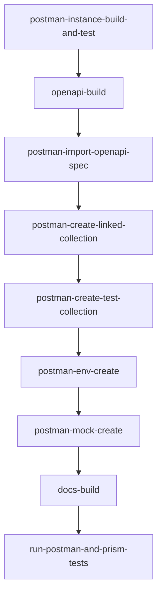
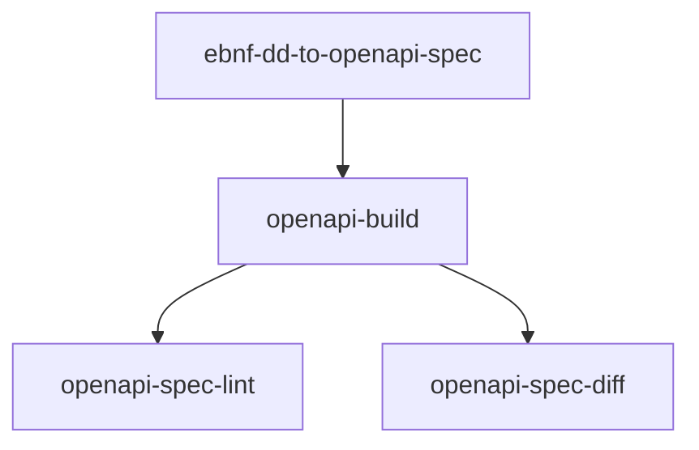
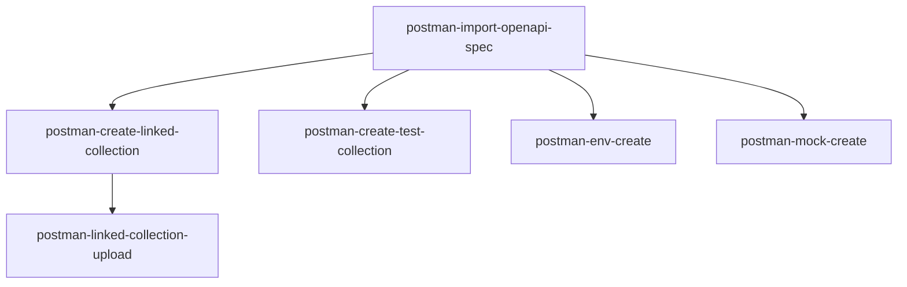
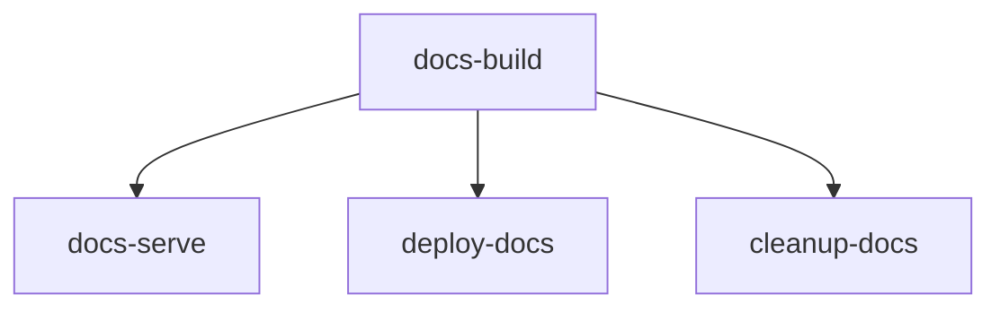
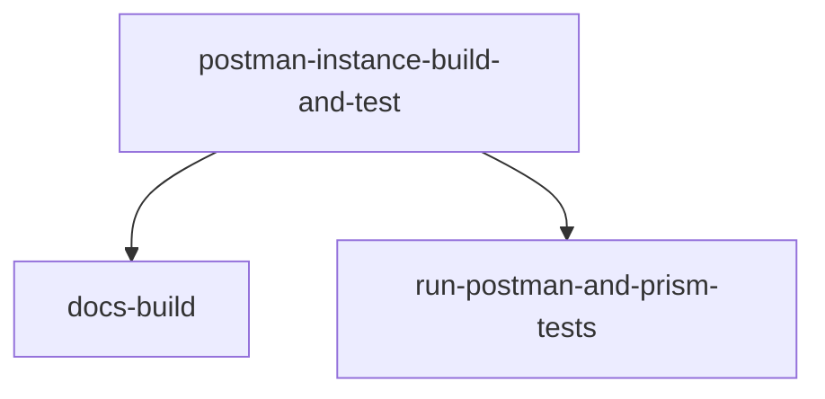
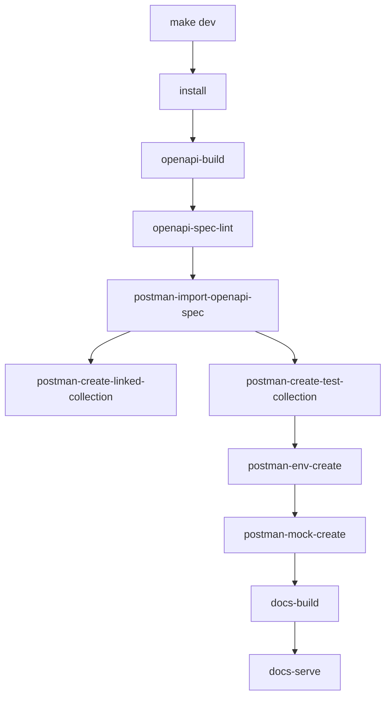
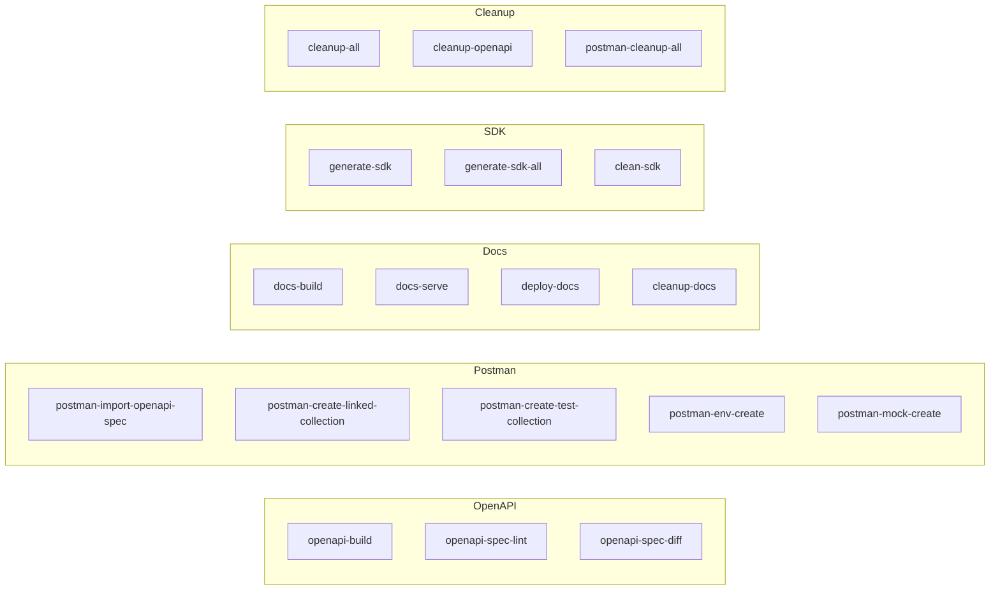
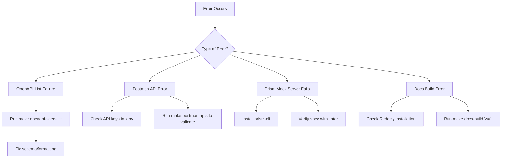
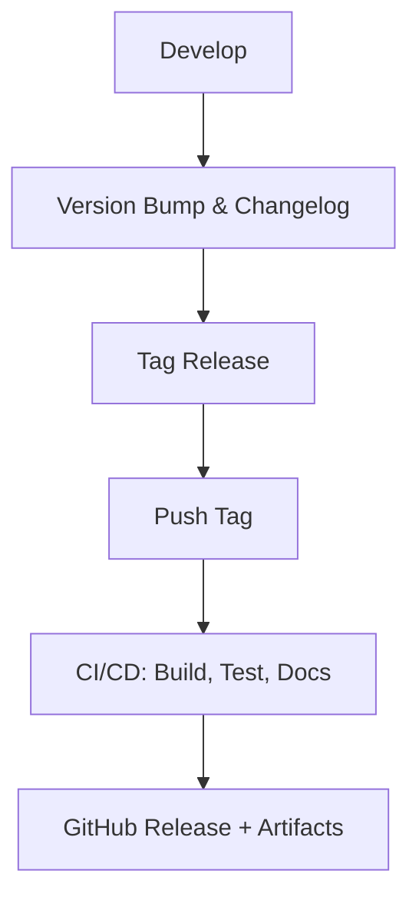
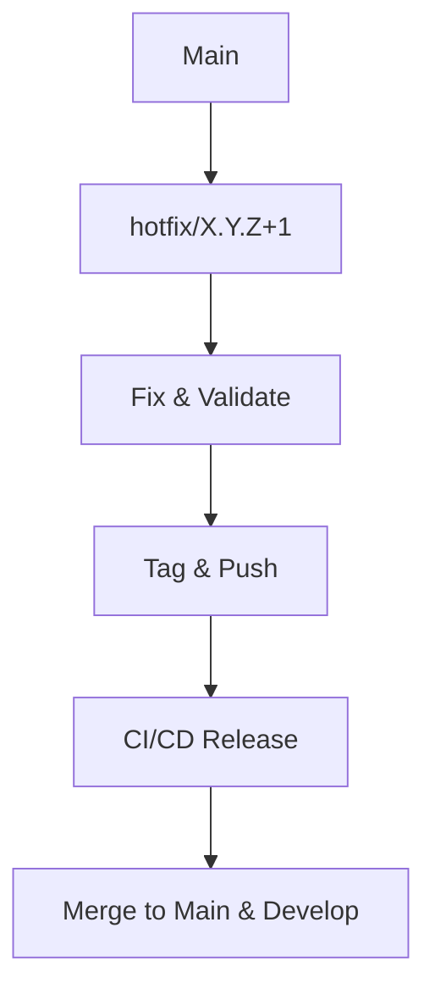

# MAKEFILE_README.md

## 1.0 Introduction
This Makefile drives the **C2M API V2 developer workflow**: converting **EBNF → OpenAPI**, integrating with **Postman** (APIs, collections, environments, mocks), generating/serving **docs**, running **tests**, and providing end-to-end **orchestration targets**.

## 2.0 Variables
Below are variables detected from the Makefile. Environment variables typically come from `.env` and Make variables are defined inline.

| Name | Operator | Value |
|---|---|---|
| `VARS_OLD` | `:=` | `$(.VARIABLES)` |
| `SHELL` | `:=` | `bash` |
| `V` | `?=` | `0` |
| `Q` | `:=` | `$(if $(filter 1,$(V)),,@)` |
| `say` | `=` | `@printf "%b\n" "$(1)"` |
| `ok` | `=` | `$(call say,✅ $(1))` |
| `err` | `=` | `$(call say,❌ $(1))` |
| `guard-file` | `=` | `test -f "$(1)" || { echo "❌ Missing file: $(1)"; exit 1; }` |
| `guard-var` | `=` | `test -n "$$($(1))" || { echo "❌ Missing var: $(1)"; exit 1; }` |
| `C2MAPIV2_POSTMAN_API_NAME_PC` | `:=` | `C2mApiV2` |
| `C2MAPIV2_POSTMAN_API_NAME_CC` | `:=` | `c2mApiV2` |
| `C2MAPIV2_POSTMAN_API_NAME_SC` | `:=` | `c2mapiv2` |
| `C2MAPIV2_POSTMAN_API_NAME_KC` | `:=` | `c2mapiv2` |
| `POSTMAN_API_NAME` | `:=` | `$(C2MAPIV2_POSTMAN_API_NAME_PC)` |
| `POSTMAN_DIR` | `:=` | `postman` |
| `POSTMAN_ENV_FILE` | `:=` | `$(POSTMAN_DIR)/mock-env.json` |
| `POSTMAN_BASE_URL` | `:=` | `https://api.getpostman.com` |
| `LOCALHOST_URL` | `:=` | `http://127.0.0.1` |
| `POSTMAN_CUSTOM_DIR` | `:=` | `$(POSTMAN_DIR)/custom` |
| `POSTMAN_GENERATED_DIR` | `:=` | `$(POSTMAN_DIR)/generated` |
| `SDKS_DIR` | `:=` | `sdks` |
| `SCRIPTS_DIR` | `:=` | `scripts` |
| `DOCS_DIR` | `:=` | `docs` |
| `DATA_DICT_DIR` | `:=` | `data_dictionary` |
| `TEMPLATES_DIR` | `:=` | `$(DOCS_DIR)/templates` |
| `DD_EBNF_FILE` | `:=` | `$(DATA_DICT_DIR)/$(C2MAPIV2_POSTMAN_API_NAME_SC)-dd.ebnf` |
| `REDOC_HTML_OUTPUT` | `:=` | `$(DOCS_DIR)/index.html` |
| `DOCS_PID_FILE` | `:=` | `$(DOCS_DIR)/http_pid.txt` |
| `POSTMAN_API_UID_FILE` | `:=` | `$(POSTMAN_DIR)/postman_api_uid.txt` |
| `POSTMAN_API_VERSION_FILE` | `:=` | `$(POSTMAN_DIR)/postman_api_version.txt` |
| `POSTMAN_APIS_URL` | `:=` | `$(POSTMAN_BASE_URL)/apis` |
| `OPENAPI_DIR` | `:=` | `openapi` |
| `C2MAPIV2_OPENAPI_SPEC` | `:=` | `$(OPENAPI_DIR)/$(C2MAPIV2_POSTMAN_API_NAME_KC)-openapi-spec-final.yaml` |
| `C2MAPIV2_MAIN_SPEC_PATH` | `:=` | `origin/main:$(C2MAPIV2_OPENAPI_SPEC)` |
| `POSTMAN_SPEC_ID_FILE` | `:=` | `$(POSTMAN_DIR)/postman_spec_uid.txt` |
| `C2MAPIV2_OPENAPI_SPEC_WITH_EXAMPLES` | `:=` | `$(basename $(C2MAPIV2_OPENAPI_SPEC))-with-examples$(suffix $(C2MAPIV2_OPENAPI_SPEC))` |
| `PREVIOUS_C2MAPIV2_OPENAPI_SPEC` | `:=` | `$(OPENAPI_DIR)/tmp-previous-spec.yaml` |
| `POSTMAN_SPECS_URL` | `:=` | `$(POSTMAN_BASE_URL)/specs` |
| `POSTMAN_SCHEMA_V2` | `:=` | `https://schema.getpostman.com/json/collection/v2.1.0/collection.json` |
| `POSTMAN_SCHEMA_UID_FILE` | `:=` | `$(POSTMAN_DIR)/schema_uid.txt` |
| `OPENAPI_OVERLAYS_DIR` | `:=` | `$(OPENAPI_DIR)/overlays` |
| `OPENAPI_AUTH_OVERLAY` | `:=` | `$(OPENAPI_OVERLAYS_DIR)/auth.tokens.yaml` |
| `C2MAPIV2_OPENAPI_SPEC_BASE` | `:=` | `$(OPENAPI_DIR)/$(C2MAPIV2_POSTMAN_API_NAME_KC)-openapi-spec-base.yaml` |
| `OPENAPI_BUNDLED_FILE` | `:=` | `$(OPENAPI_DIR)/bundled.yaml` |
| `POSTMAN_COLLECTION_RAW` | `:=` | `$(POSTMAN_GENERATED_DIR)/$(C2MAPIV2_POSTMAN_API_NAME_KC)-collection.json` |
| `POSTMAN_TEST_COLLECTION_NAME` | `:=` | `$(C2MAPIV2_POSTMAN_API_NAME_PC)TestCollection` |
| `POSTMAN_TEST_COLLECTION_TMP` | `:=` | `$(POSTMAN_GENERATED_DIR)/$(C2MAPIV2_POSTMAN_API_NAME_KC)-test-collection-tmp.json` |
| `POSTMAN_TEST_COLLECTION_FIXED` | `:=` | `$(POSTMAN_GENERATED_DIR)/$(C2MAPIV2_POSTMAN_API_NAME_KC)-test-collection-fixed.json` |
| `POSTMAN_TEST_COLLECTION_MERGED` | `:=` | `$(POSTMAN_GENERATED_DIR)/$(C2MAPIV2_POSTMAN_API_NAME_KC)-test-collection-merged.json` |
| `POSTMAN_TEST_COLLECTION_FINAL` | `:=` | `$(POSTMAN_GENERATED_DIR)/$(C2MAPIV2_POSTMAN_API_NAME_KC)-test-collection-final.json` |
| `POSTMAN_TEST_COLLECTION_UID_FILE` | `:=` | `$(POSTMAN_DIR)/test_collection_uid.txt` |
| `POSTMAN_TEST_COLLECTION_UID` | `:=` | `$(shell cat $(POSTMAN_TEST_COLLECTION_UID_FILE) 2>/dev/null || echo "")` |
| `POSTMAN_TEST_COLLECTION_WITH_EXAMPLES` | `:=` | `$(POSTMAN_GENERATED_DIR)/$(C2MAPIV2_POSTMAN_API_NAME_KC)-test-collection-with-examples.json` |
| `POSTMAN_TEST_COLLECTION_WITH_TESTS` | `:=` | `$(POSTMAN_GENERATED_DIR)/$(C2MAPIV2_POSTMAN_API_NAME_KC)-test-collection-with-tests.json` |
| `POSTMAN_TEST_COLLECTION_FIXED_WITH_TESTS` | `:=` | `$(basename $(POSTMAN_TEST_COLLECTION_FIXED))-with-tests.json` |
| `POSTMAN_LINKED_COLLECTION_UID_FILE` | `:=` | `$(POSTMAN_DIR)/postman_linked_collection_uid.txt` |
| `POSTMAN_LINKED_COLLECTION_UID` | `:=` | `$(shell cat $(POSTMAN_LINKED_COLLECTION_UID_FILE))` |
| `POSTMAN_LINKED_COLLECTION_TMP` | `:=` | `$(POSTMAN_GENERATED_DIR)/$(C2MAPIV2_POSTMAN_API_NAME_KC)-linked-collection-tmp.json` |
| `POSTMAN_LINKED_COLLECTION_NAME` | `:=` | `C2mApiCollectionLinked` |
| `POSTMAN_COLLECTIONS_URL` | `:=` | `$(POSTMAN_BASE_URL)/collections` |
| `POSTMAN_IMPORT_DEBUG` | `:=` | `$(POSTMAN_DIR)/import-debug.json` |
| `POSTMAN_LINK_PAYLOAD` | `:=` | `$(POSTMAN_DIR)/link-payload.json` |
| `POSTMAN_LINK_DEBUG` | `:=` | `$(POSTMAN_DIR)/link-debug.json` |
| `POSTMAN_VERSION_PAYLOAD` | `:=` | `$(POSTMAN_DIR)/version-payload.json` |
| `POSTMAN_VERSION_DEBUG` | `:=` | `$(POSTMAN_DIR)/version-debug.json` |
| `POSTMAN_IMPORT_PAYLOAD` | `:=` | `$(POSTMAN_DIR)/import-payload.json` |
| `POSTMAN_FULL_PAYLOAD` | `:=` | `$(POSTMAN_DIR)/full-publish-payload.json` |
| `POSTMAN_FULL_RESPONSE` | `:=` | `$(POSTMAN_DIR)/api-full-publish-response.json` |
| `POSTMAN_ENV_NAME` | `:=` | `$(C2MAPIV2_POSTMAN_API_NAME_PC)Env` |
| `POSTMAN_ENV_FILE_TEMP` | `:=` | `$(POSTMAN_DIR)/mock-env-temp.json` |
| `POSTMAN_ENV_FILE_NEW` | `:=` | `$(POSTMAN_DIR)/mock-env-new.json` |
| `POSTMAN_ENV_UID_FILE` | `:=` | `$(POSTMAN_DIR)/postman_env_uid.txt` |
| `POSTMAN_ENV_UID` | `:=` | `$(shell cat $(POSTMAN_ENV_UID_FILE))` |
| `POSTMAN_ENV_UPLOAD_DEBUG` | `:=` | `$(POSTMAN_DIR)/env-upload-debug.json` |
| `POSTMAN_ENVIRONMENTS_URL` | `:=` | `$(POSTMAN_BASE_URL)/environments` |
| `POSTMAN_MOCK_NAME` | `:=` | `$(POSTMAN_API_NAME)MockServer` |
| `POSTMAN_MOCK_PAYLOAD` | `:=` | `$(POSTMAN_DIR)/mock-payload.json` |
| `POSTMAN_MOCK_DEBUG` | `:=` | `$(POSTMAN_DIR)/mock-debug.json` |
| `POSTMAN_MOCK_VALIDATE` | `:=` | `$(POSTMAN_DIR)/mock-validate.json` |
| `POSTMAN_MOCK_UID_FILE` | `:=` | `$(POSTMAN_DIR)/postman_mock_uid.txt` |
| `POSTMAN_MOCK_LINK_DEBUG_FILE` | `:=` | `$(POSTMAN_DIR)/postman-mock-link-debug.json` |
| `POSTMAN_MOCK_UID` | `:=` | `$(shell cat $(POSTMAN_MOCK_UID_FILE) 2>/dev/null || echo "")` |
| `POSTMAN_MOCK_URL_FILE` | `:=` | `$(POSTMAN_DIR)/postman_mock_url.txt` |
| `POSTMAN_MOCKS_URL` | `:=` | `$(POSTMAN_BASE_URL)/mocks` |
| `POSTMAN_MOCK_URL` | `:=` | `$(shell cat $(POSTMAN_MOCK_URL_FILE) 2>/dev/null || echo "https://mock.api")` |
| `POSTMAN_MOCK_ID_FILE` | `:=` | `$(POSTMAN_DIR)/postman_mock_id.txt` |
| `POSTMAN_MOCK_ID` | `:=` | `$(shell cat $(POSTMAN_MOCK_ID_FILE) 2>/dev/null || echo "")` |
| `PRISM_LOG` | `?=` | `$(POSTMAN_DIR)/prism.log` |
| `PRISM_PID_FILE` | `?=` | `$(POSTMAN_DIR)/prism_pid.txt` |
| `PRISM_MOCK_TEST` | `?=` | `$(POSTMAN_DIR)/prism-mock-test-results.json` |
| `PRISM_MOCK_TEST_REPORT` | `?=` | `$(POSTMAN_DIR)/prism-mock-test-report.html` |
| `PRISM_PORT` | `?=` | `4010` |
| `PRISM_HOST` | `?=` | `127.0.0.1` |
| `PRISM_MOCK_URL_FILE` | `?=` | `$(POSTMAN_DIR)/prism_mock_url.txt` |
| `PRISM_MOCK_URL` | `?=` | `$(shell cat $(PRISM_MOCK_URL_FILE) 2>/dev/null || echo "$(LOCALHOST_URL):$(PRISM_PORT)")` |
| `PRISM_SPEC` | `?=` | `$(C2MAPIV2_OPENAPI_SPEC_WITH_EXAMPLES)` |
| `POSTMAN_OVERRIDES_FILE` | `:=` | `$(POSTMAN_CUSTOM_DIR)/overrides.json` |
| `POSTMAN_UPLOAD_TEST_DEBUG` | `:=` | `$(POSTMAN_DIR)/upload-test-debug.json` |
| `TEST_DATA_DIR` | `:=` | `test-data` |
| `REPORT_HTML` | `:=` | `$(POSTMAN_DIR)/newman-report.html` |
| `SECURITY_POSTMAN_SCRIPTS_DIR` | `:=` | `c2m-api-v2-security/postman/scripts` |
| `SECURITY_POSTMAN_SCRIPTS_DIR` | `:=` | `../c2m-api-v2-security/postman/scripts` |
| `POSTMAN_ALLOWED_CODES` | `?=` | `200,201,204,400,401,403,404,429` |
| `TEST_COLLECTION_WITH_JWT_TESTS` | `:=` | `$(POSTMAN_DIR)/generated/c2mapiv2-test-collection-jwt.json` |
| `JQ_DIR` | `:=` | `scripts/jq` |
| `JQ_ADD_INFO_FILE` | `:=` | `$(JQ_DIR)/add_info.jq` |
| `JQ_FIX_URLS_FILE` | `:=` | `$(JQ_DIR)/fix_urls.jq` |
| `JQ_AUTO_FIX_FILE` | `:=` | `$(JQ_DIR)/auto_fix.jq` |
| `JQ_VERIFY_URLS_FILE` | `:=` | `$(JQ_DIR)/verify_urls.jq` |
| `JQ_SANITIZE_COLLECTION_FILE` | `:=` | `$(JQ_DIR)/sanitize_collection.jq` |
| `jqf` | `=` | `jq -f $(1) $(2)` |
| `jqx` | `=` | `jq $(1) $(2)` |
| `ADD_EXAMPLES_TO_OPENAPI_SPEC` | `:=` | `$(SCRIPTS_DIR)/test_data_genertor_for_openapi_specs/add_examples_to_spec.py $(C2MAPIV2_OPENAPI_SPEC)` |
| `ADD_TESTS_SCRIPT` | `:=` | `$(SCRIPTS_DIR)/active/add_tests.js` |
| `EBNF_TO_OPENAPI_SCRIPT` | `:=` | `$(SCRIPTS_DIR)/active/ebnf_to_openapi_dynamic_v3.py` |
| `FIX_COLLECTION_URLS` | `:=` | `$(SCRIPTS_DIR)/active/fix_collection_urls_v2.py` |
| `FIX_PATHS_SCRIPT` | `:=` | `$(SCRIPTS_DIR)/jq/fix_paths.jq` |
| `JQ_ADD_INFO` | `:=` | `--arg name "$$(POSTMAN_LINKED_COLLECTION_NAME)" '. as $$c | {info: {name: $$name, schema: "$$(POSTMAN_SCHEMA_V2)"}, item: $$c.item}'` |
| `JQ_AUTO_FIX` | `:=` | `jq 'walk(if type == "object" and (has("name") and (has("request") | not) and (has("item") | not)) then . + { "item": [] } else . end)'` |
| `JQ_FIX_URLS` | `:=` | `jq 'walk(if type == "object" and has("url") and (.url | type) == "object" and .url.raw then .url.raw |= sub("http://localhost"; "{{baseUrl}}") else . end)'` |
| `JQ_VERIFY_URLS` | `:=` | `jq -r '.. | objects | select(has("url")) | .url.raw? // empty'` |
| `MERGE_POSTMAN_OVERRIDES` | `:=` | `$(SCRIPTS_DIR)/jq/merge_overrides.jq` |
| `MERGE_SCRIPT` | `:=` | `$(SCRIPTS_DIR)/jq/merge.jq` |
| `NODE_COLLECTION_VALIDATE` | `:=` | `node -e "const {Collection}=require('postman-collection'); const fs=require('fs'); const data=JSON.parse(fs.readFileSync('$(POSTMAN_TEST_COLLECTION_FIXED)','utf8')); try { new Collection(data); console.log('✅ Collection is valid.'); } catch(e) { console.error('❌ Validation failed:', e.message); process.exit(1); }"` |
| `POSTMAN_VALIDATOR` | `:=` | `$(SCRIPTS_DIR)/active/validate_collection.js` |
| `INSTALL_PYTHON_MODULES` | `:=` | `install -r $(SCRIPTS_DIR)/python_env/requirements.txt` |
| `ADD_EXAMPLES_TO_COLLECTION_SCRIPT` | `:=` | `node $(SCRIPTS_DIR)/test_data_generator_for_collections/addRandomDataToRaw.js` |
| `ADD_EXAMPLES_TO_COLLECTION_ARGS` | `:=` | `--input  $(POSTMAN_COLLECTION_RAW) --output $(POSTMAN_TEST_COLLECTION_WITH_EXAMPLES)` |
| `ADD_EXAMPLES_TO_COLLECTION` | `:=` | `$(ADD_EXAMPLES_TO_COLLECTION_SCRIPT) $(ADD_EXAMPLES_TO_COLLECTION_ARGS)` |
| `PYTHON_ENV_DIR` | `:=` | `$(SCRIPTS_DIR)/python_env` |
| `VENV_DIR` | `:=` | `$(PYTHON_ENV_DIR)/e2o.venv` |
| `VENV_PIP` | `:=` | `$(VENV_DIR)/bin/pip` |
| `VENV_PYTHON` | `:=` | `$(VENV_DIR)/bin/python` |
| `PYTHON3` | `:=` | `python3` |
| `PYTHON` | `:=` | `$(PYTHON3)` |
| `GENERATOR_OFFICIAL` | `:=` | `npx openapi-to-postmanv2` |
| `PRISM` | `:=` | `npx @stoplight/prism-cli` |
| `NEWMAN` | `:=` | `npx newman` |
| `REDOCLY` | `:=` | `npx @redocly/cli` |
| `SPECTRAL` | `:=` | `npx @stoplight/spectral-cli` |
| `SWAGGER` | `:=` | `npx swagger-cli` |
| `WIDDERSHINS` | `:=` | `npx widdershins` |
| `OPENAPI_DIFF` | `:=` | `npx openapi-diff` |
| `SERRAO_WS` | `:=` | `d8a1f479-a2aa-4471-869e-b12feea0a98c` |
| `C2M_WS` | `:=` | `c740f0f4-0de2-4db3-8ab6-f8a0fa6fbeb1` |
| `POSTMAN_WS` | `:=` | `$(or $(POSTMAN_WORKSPACE_OVERRIDE),$(SERRAO_WS))` |
| `POSTMAN_API_KEY` | `:=` | `$(or $(POSTMAN_API_KEY_OVERRIDE),$(POSTMAN_SERRAO_API_KEY),$(POSTMAN_C2M_API_KEY))` |
| `TOKEN_RAW` | `:=` | `$(shell [ -f $(POSTMAN_ENV_FILE) ] && jq -r '.environment.values[] | select(.key=="token") | .value' $(POSTMAN_ENV_FILE) 2>/dev/null || echo "")` |
| `TOKEN` | `:=` | `$(if $(TOKEN_RAW),$(TOKEN_RAW),dummy-token)` |
| `POSTMAN_HEADER_API_KEY` | `:=` | `--header "X-Api-Key: $(POSTMAN_API_KEY)"` |
| `POSTMAN_HEADER_CONTENT_TYPE` | `:=` | `--header "Content-Type: application/json"` |
| `POSTMAN_HEADER_ACCEPT` | `:=` | `--header "Accept: application/vnd.api.v10+json"` |
| `POSTMAN_HEADER_AUTH` | `:=` | `--header "Authorization: Bearer $(POSTMAN_API_KEY)"` |
| `POSTMAN_CURL_HEADERS_XC` | `:=` | `$(POSTMAN_HEADER_API_KEY) $(POSTMAN_HEADER_CONTENT_TYPE)` |
| `POSTMAN_CURL_HEADERS_AA` | `:=` | `$(POSTMAN_HEADER_ACCEPT) $(POSTMAN_HEADER_AUTH)` |
| `POSTMAN_CURL_HEADERS_ACA` | `:=` | `$(POSTMAN_HEADER_ACCEPT) $(POSTMAN_HEADER_CONTENT_TYPE) $(POSTMAN_HEADER_AUTH)` |
| `POSTMAN_Q_ID` | `:=` | `?workspaceId=$(POSTMAN_WS)` |
| `POSTMAN_Q` | `:=` | `?workspace=$(POSTMAN_WS)` |
| `POSTMAN_LINKED_COLLECTION_FLAT` | `:=` | `$(POSTMAN_GENERATED_DIR)/$(C2MAPIV2_POSTMAN_API_NAME_KC)-linked-collection-flat.json` |
| `POSTMAN_TEST_COLLECTION_FLAT` | `:=` | `$(POSTMAN_GENERATED_DIR)/$(C2MAPIV2_POSTMAN_API_NAME_KC)-test-collection-flat.json` |
| `CUR-DIR` | `:=` | `$(shell pwd)` |
| `LOG-DIR` | `:=` | `$(CUR-DIR)/make-logs` |

### 2.1 Notes on Variables & Helpers
- **Verbosity**: Use `V=1` to show underlying commands.
- **Guard helpers**: If present (e.g., `guard-file`, `guard-var`), they ensure required files/vars exist.
- **Shell**: Many Makefiles use `SHELL` and strict flags; commands shown below reflect what runs.

## 3.0 Orchestration Targets
These targets primarily **call other make targets** and orchestrate multi-step workflows. They typically contain recipes that only invoke `$(MAKE)`/`make`, with minimal direct shell commands.

### 3.6 `postman-docs-build-and-serve-up`

**Type:** Orchestration

**Depends on:** _None_

**Usage:**
```bash
make postman-docs-build-and-serve-up
```

**Invokes:**
```bash
# Generate and serve documentation
$(MAKE) docs-build
# use docs-serve-bg if you don't want blocking here
$(MAKE) docs-serve
```

## 4.0 Functional Targets (Grouped)
Below are all functional targets, grouped by purpose. Each includes a usage example and the underlying commands executed.

### 4.1 OpenAPI

#### 4.1.1 `ADD_EXAMPLES_TO_OPENAPI_SPEC`

**Depends on:** =, $(SCRIPTS_DIR)/test_data_genertor_for_openapi_specs/add_examples_to_spec.py, $(C2MAPIV2_OPENAPI_SPEC)

**Usage:**
```bash
make ADD_EXAMPLES_TO_OPENAPI_SPEC
```

_No underlying shell commands found in this target._

#### 4.1.2 `C2MAPIV2_OPENAPI_SPEC`

**Depends on:** =, $(OPENAPI_DIR)/$(C2MAPIV2_POSTMAN_API_NAME_KC)-openapi-spec-final.yaml

**Usage:**
```bash
make C2MAPIV2_OPENAPI_SPEC
```

_No underlying shell commands found in this target._

#### 4.1.3 `C2MAPIV2_OPENAPI_SPEC_BASE`

**Depends on:** =, $(OPENAPI_DIR)/$(C2MAPIV2_POSTMAN_API_NAME_KC)-openapi-spec-base.yaml

**Usage:**
```bash
make C2MAPIV2_OPENAPI_SPEC_BASE
```

_No underlying shell commands found in this target._

#### 4.1.4 `C2MAPIV2_OPENAPI_SPEC_WITH_EXAMPLES`

**Depends on:** =, $(basename, $(C2MAPIV2_OPENAPI_SPEC))-with-examples$(suffix, $(C2MAPIV2_OPENAPI_SPEC))

**Usage:**
```bash
make C2MAPIV2_OPENAPI_SPEC_WITH_EXAMPLES
```

_No underlying shell commands found in this target._

#### 4.1.5 `DD_EBNF_FILE`

**Depends on:** =, $(DATA_DICT_DIR)/$(C2MAPIV2_POSTMAN_API_NAME_SC)-dd.ebnf

**Usage:**
```bash
make DD_EBNF_FILE
```

_No underlying shell commands found in this target._

#### 4.1.6 `EBNF_TO_OPENAPI_SCRIPT`

**Depends on:** =, $(SCRIPTS_DIR)/active/ebnf_to_openapi_dynamic_v3.py

**Usage:**
```bash
make EBNF_TO_OPENAPI_SCRIPT
```

_No underlying shell commands found in this target._

#### 4.1.7 `OPENAPI_AUTH_OVERLAY`

**Depends on:** =, $(OPENAPI_OVERLAYS_DIR)/auth.tokens.yaml

**Usage:**
```bash
make OPENAPI_AUTH_OVERLAY
```

_No underlying shell commands found in this target._

#### 4.1.8 `OPENAPI_BUNDLED_FILE`

**Depends on:** =, $(OPENAPI_DIR)/bundled.yaml

**Usage:**
```bash
make OPENAPI_BUNDLED_FILE
```

_No underlying shell commands found in this target._

#### 4.1.9 `OPENAPI_DIFF`

**Depends on:** =, npx, openapi-diff

**Usage:**
```bash
make OPENAPI_DIFF
```

_No underlying shell commands found in this target._

#### 4.1.10 `OPENAPI_DIR`

**Depends on:** =, openapi

**Usage:**
```bash
make OPENAPI_DIR
```

_No underlying shell commands found in this target._

#### 4.1.11 `OPENAPI_OVERLAYS_DIR`

**Depends on:** =, $(OPENAPI_DIR)/overlays

**Usage:**
```bash
make OPENAPI_OVERLAYS_DIR
```

_No underlying shell commands found in this target._

#### 4.1.12 `PREVIOUS_C2MAPIV2_OPENAPI_SPEC`

**Depends on:** =, $(OPENAPI_DIR)/tmp-previous-spec.yaml

**Usage:**
```bash
make PREVIOUS_C2MAPIV2_OPENAPI_SPEC
```

_No underlying shell commands found in this target._

### 4.2 Postman

#### 4.2.1 `C2MAPIV2_POSTMAN_API_NAME_CC`

**Depends on:** =, c2mApiV2

**Usage:**
```bash
make C2MAPIV2_POSTMAN_API_NAME_CC
```

_No underlying shell commands found in this target._

#### 4.2.2 `C2MAPIV2_POSTMAN_API_NAME_KC`

**Depends on:** =, c2mapiv2

**Usage:**
```bash
make C2MAPIV2_POSTMAN_API_NAME_KC
```

_No underlying shell commands found in this target._

#### 4.2.3 `C2MAPIV2_POSTMAN_API_NAME_PC`

**Depends on:** =, C2mApiV2

**Usage:**
```bash
make C2MAPIV2_POSTMAN_API_NAME_PC
```

_No underlying shell commands found in this target._

#### 4.2.4 `C2MAPIV2_POSTMAN_API_NAME_SC`

**Depends on:** =, c2mapiv2

**Usage:**
```bash
make C2MAPIV2_POSTMAN_API_NAME_SC
```

_No underlying shell commands found in this target._

#### 4.2.5 `MERGE_POSTMAN_OVERRIDES`

**Depends on:** =, $(SCRIPTS_DIR)/jq/merge_overrides.jq

**Usage:**
```bash
make MERGE_POSTMAN_OVERRIDES
```

_No underlying shell commands found in this target._

#### 4.2.6 `POSTMAN_APIS_URL`

**Depends on:** =, $(POSTMAN_BASE_URL)/apis

**Usage:**
```bash
make POSTMAN_APIS_URL
```

_No underlying shell commands found in this target._

#### 4.2.7 `POSTMAN_API_KEY`

**Depends on:** =, $(or, $(POSTMAN_API_KEY_OVERRIDE),$(POSTMAN_SERRAO_API_KEY),$(POSTMAN_C2M_API_KEY))

**Usage:**
```bash
make POSTMAN_API_KEY
```

_No underlying shell commands found in this target._

#### 4.2.8 `POSTMAN_API_NAME`

**Depends on:** =, $(C2MAPIV2_POSTMAN_API_NAME_PC)

**Usage:**
```bash
make POSTMAN_API_NAME
```

_No underlying shell commands found in this target._

#### 4.2.9 `POSTMAN_API_UID_FILE`

**Depends on:** =, $(POSTMAN_DIR)/postman_api_uid.txt

**Usage:**
```bash
make POSTMAN_API_UID_FILE
```

_No underlying shell commands found in this target._

#### 4.2.10 `POSTMAN_API_VERSION_FILE`

**Depends on:** =, $(POSTMAN_DIR)/postman_api_version.txt

**Usage:**
```bash
make POSTMAN_API_VERSION_FILE
```

_No underlying shell commands found in this target._

#### 4.2.11 `POSTMAN_BASE_URL`

**Depends on:** =, https://api.getpostman.com

**Usage:**
```bash
make POSTMAN_BASE_URL
```

_No underlying shell commands found in this target._

#### 4.2.12 `POSTMAN_COLLECTIONS_URL`

**Depends on:** =, $(POSTMAN_BASE_URL)/collections

**Usage:**
```bash
make POSTMAN_COLLECTIONS_URL
```

_No underlying shell commands found in this target._

#### 4.2.13 `POSTMAN_COLLECTION_RAW`

**Depends on:** =, $(POSTMAN_GENERATED_DIR)/$(C2MAPIV2_POSTMAN_API_NAME_KC)-collection.json

**Usage:**
```bash
make POSTMAN_COLLECTION_RAW
```

_No underlying shell commands found in this target._

#### 4.2.14 `POSTMAN_CURL_HEADERS_AA`

**Depends on:** =, $(POSTMAN_HEADER_ACCEPT), $(POSTMAN_HEADER_AUTH)

**Usage:**
```bash
make POSTMAN_CURL_HEADERS_AA
```

_No underlying shell commands found in this target._

#### 4.2.15 `POSTMAN_CURL_HEADERS_ACA`

**Depends on:** =, $(POSTMAN_HEADER_ACCEPT), $(POSTMAN_HEADER_CONTENT_TYPE), $(POSTMAN_HEADER_AUTH)

**Usage:**
```bash
make POSTMAN_CURL_HEADERS_ACA
```

_No underlying shell commands found in this target._

#### 4.2.16 `POSTMAN_CURL_HEADERS_XC`

**Depends on:** =, $(POSTMAN_HEADER_API_KEY), $(POSTMAN_HEADER_CONTENT_TYPE)

**Usage:**
```bash
make POSTMAN_CURL_HEADERS_XC
```

_No underlying shell commands found in this target._

#### 4.2.17 `POSTMAN_CUSTOM_DIR`

**Depends on:** =, $(POSTMAN_DIR)/custom

**Usage:**
```bash
make POSTMAN_CUSTOM_DIR
```

_No underlying shell commands found in this target._

#### 4.2.18 `POSTMAN_DIR`

**Depends on:** =, postman

**Usage:**
```bash
make POSTMAN_DIR
```

_No underlying shell commands found in this target._

#### 4.2.19 `POSTMAN_ENVIRONMENTS_URL`

**Depends on:** =, $(POSTMAN_BASE_URL)/environments

**Usage:**
```bash
make POSTMAN_ENVIRONMENTS_URL
```

_No underlying shell commands found in this target._

#### 4.2.20 `POSTMAN_ENV_FILE`

**Depends on:** =, $(POSTMAN_DIR)/mock-env.json

**Usage:**
```bash
make POSTMAN_ENV_FILE
```

_No underlying shell commands found in this target._

#### 4.2.21 `POSTMAN_ENV_FILE_NEW`

**Depends on:** =, $(POSTMAN_DIR)/mock-env-new.json

**Usage:**
```bash
make POSTMAN_ENV_FILE_NEW
```

_No underlying shell commands found in this target._

#### 4.2.22 `POSTMAN_ENV_FILE_TEMP`

**Depends on:** =, $(POSTMAN_DIR)/mock-env-temp.json

**Usage:**
```bash
make POSTMAN_ENV_FILE_TEMP
```

_No underlying shell commands found in this target._

#### 4.2.23 `POSTMAN_ENV_NAME`

**Depends on:** =, $(C2MAPIV2_POSTMAN_API_NAME_PC)Env

**Usage:**
```bash
make POSTMAN_ENV_NAME
```

_No underlying shell commands found in this target._

#### 4.2.24 `POSTMAN_ENV_UID`

**Depends on:** =, $(shell, cat, $(POSTMAN_ENV_UID_FILE))

**Usage:**
```bash
make POSTMAN_ENV_UID
```

_No underlying shell commands found in this target._

#### 4.2.25 `POSTMAN_ENV_UID_FILE`

**Depends on:** =, $(POSTMAN_DIR)/postman_env_uid.txt

**Usage:**
```bash
make POSTMAN_ENV_UID_FILE
```

_No underlying shell commands found in this target._

#### 4.2.26 `POSTMAN_ENV_UPLOAD_DEBUG`

**Depends on:** =, $(POSTMAN_DIR)/env-upload-debug.json

**Usage:**
```bash
make POSTMAN_ENV_UPLOAD_DEBUG
```

_No underlying shell commands found in this target._

#### 4.2.27 `POSTMAN_FULL_PAYLOAD`

**Depends on:** =, $(POSTMAN_DIR)/full-publish-payload.json

**Usage:**
```bash
make POSTMAN_FULL_PAYLOAD
```

_No underlying shell commands found in this target._

#### 4.2.28 `POSTMAN_FULL_RESPONSE`

**Depends on:** =, $(POSTMAN_DIR)/api-full-publish-response.json

**Usage:**
```bash
make POSTMAN_FULL_RESPONSE
```

_No underlying shell commands found in this target._

#### 4.2.29 `POSTMAN_GENERATED_DIR`

**Depends on:** =, $(POSTMAN_DIR)/generated

**Usage:**
```bash
make POSTMAN_GENERATED_DIR
```

_No underlying shell commands found in this target._

#### 4.2.30 `POSTMAN_HEADER_ACCEPT`

**Depends on:** =, --header, "Accept:, application/vnd.api.v10+json"

**Usage:**
```bash
make POSTMAN_HEADER_ACCEPT
```

_No underlying shell commands found in this target._

#### 4.2.31 `POSTMAN_HEADER_API_KEY`

**Depends on:** =, --header, "X-Api-Key:, $(POSTMAN_API_KEY)"

**Usage:**
```bash
make POSTMAN_HEADER_API_KEY
```

_No underlying shell commands found in this target._

#### 4.2.32 `POSTMAN_HEADER_AUTH`

**Depends on:** =, --header, "Authorization:, Bearer, $(POSTMAN_API_KEY)"

**Usage:**
```bash
make POSTMAN_HEADER_AUTH
```

_No underlying shell commands found in this target._

#### 4.2.33 `POSTMAN_HEADER_CONTENT_TYPE`

**Depends on:** =, --header, "Content-Type:, application/json"

**Usage:**
```bash
make POSTMAN_HEADER_CONTENT_TYPE
```

_No underlying shell commands found in this target._

#### 4.2.34 `POSTMAN_IMPORT_DEBUG`

**Depends on:** =, $(POSTMAN_DIR)/import-debug.json

**Usage:**
```bash
make POSTMAN_IMPORT_DEBUG
```

_No underlying shell commands found in this target._

#### 4.2.35 `POSTMAN_IMPORT_PAYLOAD`

**Depends on:** =, $(POSTMAN_DIR)/import-payload.json

**Usage:**
```bash
make POSTMAN_IMPORT_PAYLOAD
```

_No underlying shell commands found in this target._

#### 4.2.36 `POSTMAN_LINKED_COLLECTION_FLAT`

**Depends on:** =, $(POSTMAN_GENERATED_DIR)/$(C2MAPIV2_POSTMAN_API_NAME_KC)-linked-collection-flat.json

**Usage:**
```bash
make POSTMAN_LINKED_COLLECTION_FLAT
```

_No underlying shell commands found in this target._

#### 4.2.37 `POSTMAN_LINKED_COLLECTION_NAME`

**Depends on:** =, C2mApiCollectionLinked

**Usage:**
```bash
make POSTMAN_LINKED_COLLECTION_NAME
```

_No underlying shell commands found in this target._

#### 4.2.38 `POSTMAN_LINKED_COLLECTION_TMP`

**Depends on:** =, $(POSTMAN_GENERATED_DIR)/$(C2MAPIV2_POSTMAN_API_NAME_KC)-linked-collection-tmp.json

**Usage:**
```bash
make POSTMAN_LINKED_COLLECTION_TMP
```

_No underlying shell commands found in this target._

#### 4.2.39 `POSTMAN_LINKED_COLLECTION_UID`

**Depends on:** =, $(shell, cat, $(POSTMAN_LINKED_COLLECTION_UID_FILE))

**Usage:**
```bash
make POSTMAN_LINKED_COLLECTION_UID
```

_No underlying shell commands found in this target._

#### 4.2.40 `POSTMAN_LINKED_COLLECTION_UID_FILE`

**Depends on:** =, $(POSTMAN_DIR)/postman_linked_collection_uid.txt

**Usage:**
```bash
make POSTMAN_LINKED_COLLECTION_UID_FILE
```

_No underlying shell commands found in this target._

#### 4.2.41 `POSTMAN_LINK_DEBUG`

**Depends on:** =, $(POSTMAN_DIR)/link-debug.json

**Usage:**
```bash
make POSTMAN_LINK_DEBUG
```

_No underlying shell commands found in this target._

#### 4.2.42 `POSTMAN_LINK_PAYLOAD`

**Depends on:** =, $(POSTMAN_DIR)/link-payload.json

**Usage:**
```bash
make POSTMAN_LINK_PAYLOAD
```

_No underlying shell commands found in this target._

#### 4.2.43 `POSTMAN_MOCKS_URL`

**Depends on:** =, $(POSTMAN_BASE_URL)/mocks

**Usage:**
```bash
make POSTMAN_MOCKS_URL
```

_No underlying shell commands found in this target._

#### 4.2.44 `POSTMAN_MOCK_DEBUG`

**Depends on:** =, $(POSTMAN_DIR)/mock-debug.json

**Usage:**
```bash
make POSTMAN_MOCK_DEBUG
```

_No underlying shell commands found in this target._

#### 4.2.45 `POSTMAN_MOCK_ID`

**Depends on:** =, $(shell, cat, $(POSTMAN_MOCK_ID_FILE), 2>/dev/null, ||, echo, "")

**Usage:**
```bash
make POSTMAN_MOCK_ID
```

_No underlying shell commands found in this target._

#### 4.2.46 `POSTMAN_MOCK_ID_FILE`

**Depends on:** =, $(POSTMAN_DIR)/postman_mock_id.txt

**Usage:**
```bash
make POSTMAN_MOCK_ID_FILE
```

_No underlying shell commands found in this target._

#### 4.2.47 `POSTMAN_MOCK_LINK_DEBUG_FILE`

**Depends on:** =, $(POSTMAN_DIR)/postman-mock-link-debug.json

**Usage:**
```bash
make POSTMAN_MOCK_LINK_DEBUG_FILE
```

_No underlying shell commands found in this target._

#### 4.2.48 `POSTMAN_MOCK_NAME`

**Depends on:** =, $(POSTMAN_API_NAME)MockServer

**Usage:**
```bash
make POSTMAN_MOCK_NAME
```

_No underlying shell commands found in this target._

#### 4.2.49 `POSTMAN_MOCK_PAYLOAD`

**Depends on:** =, $(POSTMAN_DIR)/mock-payload.json

**Usage:**
```bash
make POSTMAN_MOCK_PAYLOAD
```

_No underlying shell commands found in this target._

#### 4.2.50 `POSTMAN_MOCK_UID`

**Depends on:** =, $(shell, cat, $(POSTMAN_MOCK_UID_FILE), 2>/dev/null, ||, echo, "")

**Usage:**
```bash
make POSTMAN_MOCK_UID
```

_No underlying shell commands found in this target._

#### 4.2.51 `POSTMAN_MOCK_UID_FILE`

**Depends on:** =, $(POSTMAN_DIR)/postman_mock_uid.txt

**Usage:**
```bash
make POSTMAN_MOCK_UID_FILE
```

_No underlying shell commands found in this target._

#### 4.2.52 `POSTMAN_MOCK_URL`

**Depends on:** =, $(shell, cat, $(POSTMAN_MOCK_URL_FILE), 2>/dev/null, ||, echo, "https://mock.api")

**Usage:**
```bash
make POSTMAN_MOCK_URL
```

_No underlying shell commands found in this target._

#### 4.2.53 `POSTMAN_MOCK_URL_FILE`

**Depends on:** =, $(POSTMAN_DIR)/postman_mock_url.txt

**Usage:**
```bash
make POSTMAN_MOCK_URL_FILE
```

_No underlying shell commands found in this target._

#### 4.2.54 `POSTMAN_MOCK_VALIDATE`

**Depends on:** =, $(POSTMAN_DIR)/mock-validate.json

**Usage:**
```bash
make POSTMAN_MOCK_VALIDATE
```

_No underlying shell commands found in this target._

#### 4.2.55 `POSTMAN_OVERRIDES_FILE`

**Depends on:** =, $(POSTMAN_CUSTOM_DIR)/overrides.json

**Usage:**
```bash
make POSTMAN_OVERRIDES_FILE
```

_No underlying shell commands found in this target._

#### 4.2.56 `POSTMAN_Q`

**Depends on:** =, ?workspace=$(POSTMAN_WS)

**Usage:**
```bash
make POSTMAN_Q
```

_No underlying shell commands found in this target._

#### 4.2.57 `POSTMAN_Q_ID`

**Depends on:** =, ?workspaceId=$(POSTMAN_WS)

**Usage:**
```bash
make POSTMAN_Q_ID
```

_No underlying shell commands found in this target._

#### 4.2.58 `POSTMAN_SCHEMA_UID_FILE`

**Depends on:** =, $(POSTMAN_DIR)/schema_uid.txt

**Usage:**
```bash
make POSTMAN_SCHEMA_UID_FILE
```

_No underlying shell commands found in this target._

#### 4.2.59 `POSTMAN_SCHEMA_V2`

**Depends on:** =, https://schema.getpostman.com/json/collection/v2.1.0/collection.json

**Usage:**
```bash
make POSTMAN_SCHEMA_V2
```

_No underlying shell commands found in this target._

#### 4.2.60 `POSTMAN_SPECS_URL`

**Depends on:** =, $(POSTMAN_BASE_URL)/specs

**Usage:**
```bash
make POSTMAN_SPECS_URL
```

_No underlying shell commands found in this target._

#### 4.2.61 `POSTMAN_SPEC_ID_FILE`

**Depends on:** =, $(POSTMAN_DIR)/postman_spec_uid.txt

**Usage:**
```bash
make POSTMAN_SPEC_ID_FILE
```

_No underlying shell commands found in this target._

#### 4.2.62 `POSTMAN_TEST_COLLECTION_FINAL`

**Depends on:** =, $(POSTMAN_GENERATED_DIR)/$(C2MAPIV2_POSTMAN_API_NAME_KC)-test-collection-final.json

**Usage:**
```bash
make POSTMAN_TEST_COLLECTION_FINAL
```

_No underlying shell commands found in this target._

#### 4.2.63 `POSTMAN_TEST_COLLECTION_FIXED`

**Depends on:** =, $(POSTMAN_GENERATED_DIR)/$(C2MAPIV2_POSTMAN_API_NAME_KC)-test-collection-fixed.json

**Usage:**
```bash
make POSTMAN_TEST_COLLECTION_FIXED
```

_No underlying shell commands found in this target._

#### 4.2.64 `POSTMAN_TEST_COLLECTION_FIXED_WITH_TESTS`

**Depends on:** =, $(basename, $(POSTMAN_TEST_COLLECTION_FIXED))-with-tests.json

**Usage:**
```bash
make POSTMAN_TEST_COLLECTION_FIXED_WITH_TESTS
```

_No underlying shell commands found in this target._

#### 4.2.65 `POSTMAN_TEST_COLLECTION_FLAT`

**Depends on:** =, $(POSTMAN_GENERATED_DIR)/$(C2MAPIV2_POSTMAN_API_NAME_KC)-test-collection-flat.json

**Usage:**
```bash
make POSTMAN_TEST_COLLECTION_FLAT
```

_No underlying shell commands found in this target._

#### 4.2.66 `POSTMAN_TEST_COLLECTION_MERGED`

**Depends on:** =, $(POSTMAN_GENERATED_DIR)/$(C2MAPIV2_POSTMAN_API_NAME_KC)-test-collection-merged.json

**Usage:**
```bash
make POSTMAN_TEST_COLLECTION_MERGED
```

_No underlying shell commands found in this target._

#### 4.2.67 `POSTMAN_TEST_COLLECTION_NAME`

**Depends on:** =, $(C2MAPIV2_POSTMAN_API_NAME_PC)TestCollection

**Usage:**
```bash
make POSTMAN_TEST_COLLECTION_NAME
```

_No underlying shell commands found in this target._

#### 4.2.68 `POSTMAN_TEST_COLLECTION_TMP`

**Depends on:** =, $(POSTMAN_GENERATED_DIR)/$(C2MAPIV2_POSTMAN_API_NAME_KC)-test-collection-tmp.json

**Usage:**
```bash
make POSTMAN_TEST_COLLECTION_TMP
```

_No underlying shell commands found in this target._

#### 4.2.69 `POSTMAN_TEST_COLLECTION_UID`

**Depends on:** =, $(shell, cat, $(POSTMAN_TEST_COLLECTION_UID_FILE), 2>/dev/null, ||, echo, "")

**Usage:**
```bash
make POSTMAN_TEST_COLLECTION_UID
```

_No underlying shell commands found in this target._

#### 4.2.70 `POSTMAN_TEST_COLLECTION_UID_FILE`

**Depends on:** =, $(POSTMAN_DIR)/test_collection_uid.txt

**Usage:**
```bash
make POSTMAN_TEST_COLLECTION_UID_FILE
```

_No underlying shell commands found in this target._

#### 4.2.71 `POSTMAN_TEST_COLLECTION_WITH_EXAMPLES`

**Depends on:** =, $(POSTMAN_GENERATED_DIR)/$(C2MAPIV2_POSTMAN_API_NAME_KC)-test-collection-with-examples.json

**Usage:**
```bash
make POSTMAN_TEST_COLLECTION_WITH_EXAMPLES
```

_No underlying shell commands found in this target._

#### 4.2.72 `POSTMAN_TEST_COLLECTION_WITH_TESTS`

**Depends on:** =, $(POSTMAN_GENERATED_DIR)/$(C2MAPIV2_POSTMAN_API_NAME_KC)-test-collection-with-tests.json

**Usage:**
```bash
make POSTMAN_TEST_COLLECTION_WITH_TESTS
```

_No underlying shell commands found in this target._

#### 4.2.73 `POSTMAN_UPLOAD_TEST_DEBUG`

**Depends on:** =, $(POSTMAN_DIR)/upload-test-debug.json

**Usage:**
```bash
make POSTMAN_UPLOAD_TEST_DEBUG
```

_No underlying shell commands found in this target._

#### 4.2.74 `POSTMAN_VALIDATOR`

**Depends on:** =, $(SCRIPTS_DIR)/active/validate_collection.js

**Usage:**
```bash
make POSTMAN_VALIDATOR
```

_No underlying shell commands found in this target._

#### 4.2.75 `POSTMAN_VERSION_DEBUG`

**Depends on:** =, $(POSTMAN_DIR)/version-debug.json

**Usage:**
```bash
make POSTMAN_VERSION_DEBUG
```

_No underlying shell commands found in this target._

#### 4.2.76 `POSTMAN_VERSION_PAYLOAD`

**Depends on:** =, $(POSTMAN_DIR)/version-payload.json

**Usage:**
```bash
make POSTMAN_VERSION_PAYLOAD
```

_No underlying shell commands found in this target._

#### 4.2.77 `POSTMAN_WS`

**Depends on:** =, $(or, $(POSTMAN_WORKSPACE_OVERRIDE),$(SERRAO_WS))

**Usage:**
```bash
make POSTMAN_WS
```

_No underlying shell commands found in this target._

#### 4.2.78 `SECURITY_POSTMAN_SCRIPTS_DIR`

**Depends on:** =, ../c2m-api-v2-security/postman/scripts

**Usage:**
```bash
make SECURITY_POSTMAN_SCRIPTS_DIR
```

_No underlying shell commands found in this target._

### 4.3 Docs

#### 4.3.1 `DOCS_DIR`

**Depends on:** =, docs

**Usage:**
```bash
make DOCS_DIR
```

_No underlying shell commands found in this target._

#### 4.3.2 `DOCS_PID_FILE`

**Depends on:** =, $(DOCS_DIR)/http_pid.txt

**Usage:**
```bash
make DOCS_PID_FILE
```

_No underlying shell commands found in this target._

#### 4.3.3 `REDOCLY`

**Depends on:** =, npx, @redocly/cli

**Usage:**
```bash
make REDOCLY
```

_No underlying shell commands found in this target._

#### 4.3.4 `REDOC_HTML_OUTPUT`

**Depends on:** =, $(DOCS_DIR)/index.html

**Usage:**
```bash
make REDOC_HTML_OUTPUT
```

_No underlying shell commands found in this target._

#### 4.3.5 `SWAGGER`

**Depends on:** =, npx, swagger-cli

**Usage:**
```bash
make SWAGGER
```

_No underlying shell commands found in this target._

### 4.4 SDK

#### 4.4.1 `SDKS_DIR`

**Depends on:** =, sdks

**Usage:**
```bash
make SDKS_DIR
```

_No underlying shell commands found in this target._

### 4.7 Testing & QA

#### 4.7.1 `ADD_TESTS_SCRIPT`

**Depends on:** =, $(SCRIPTS_DIR)/active/add_tests.js

**Usage:**
```bash
make ADD_TESTS_SCRIPT
```

_No underlying shell commands found in this target._

#### 4.7.2 `NEWMAN`

**Depends on:** =, npx, newman

**Usage:**
```bash
make NEWMAN
```

_No underlying shell commands found in this target._

#### 4.7.3 `PRISM`

**Depends on:** =, npx, @stoplight/prism-cli

**Usage:**
```bash
make PRISM
```

_No underlying shell commands found in this target._

#### 4.7.4 `TEST_COLLECTION_WITH_JWT_TESTS`

**Depends on:** =, $(POSTMAN_DIR)/generated/c2mapiv2-test-collection-jwt.json

**Usage:**
```bash
make TEST_COLLECTION_WITH_JWT_TESTS
```

_No underlying shell commands found in this target._

#### 4.7.5 `TEST_DATA_DIR`

**Depends on:** =, test-data

**Usage:**
```bash
make TEST_DATA_DIR
```

_No underlying shell commands found in this target._

### 4.8 Environment & Install

#### 4.8.1 `INSTALL_PYTHON_MODULES`

**Depends on:** =, install, -r, $(SCRIPTS_DIR)/python_env/requirements.txt

**Usage:**
```bash
make INSTALL_PYTHON_MODULES
```

_No underlying shell commands found in this target._

#### 4.8.2 `VENV_DIR`

**Depends on:** =, $(PYTHON_ENV_DIR)/e2o.venv

**Usage:**
```bash
make VENV_DIR
```

_No underlying shell commands found in this target._

#### 4.8.3 `VENV_PIP`

**Depends on:** =, $(VENV_DIR)/bin/pip

**Usage:**
```bash
make VENV_PIP
```

_No underlying shell commands found in this target._

#### 4.8.4 `VENV_PYTHON`

**Depends on:** =, $(VENV_DIR)/bin/python

**Usage:**
```bash
make VENV_PYTHON
```

_No underlying shell commands found in this target._

### 4.9 Miscellaneous

#### 4.9.1 `ADD_EXAMPLES_TO_COLLECTION`

**Depends on:** =, $(ADD_EXAMPLES_TO_COLLECTION_SCRIPT), $(ADD_EXAMPLES_TO_COLLECTION_ARGS)

**Usage:**
```bash
make ADD_EXAMPLES_TO_COLLECTION
```

_No underlying shell commands found in this target._

#### 4.9.2 `ADD_EXAMPLES_TO_COLLECTION_ARGS`

**Depends on:** =, --input, $(POSTMAN_COLLECTION_RAW), --output, $(POSTMAN_TEST_COLLECTION_WITH_EXAMPLES)

**Usage:**
```bash
make ADD_EXAMPLES_TO_COLLECTION_ARGS
```

_No underlying shell commands found in this target._

#### 4.9.3 `ADD_EXAMPLES_TO_COLLECTION_SCRIPT`

**Depends on:** =, node, $(SCRIPTS_DIR)/test_data_generator_for_collections/addRandomDataToRaw.js

**Usage:**
```bash
make ADD_EXAMPLES_TO_COLLECTION_SCRIPT
```

_No underlying shell commands found in this target._

#### 4.9.4 `C2MAPIV2_MAIN_SPEC_PATH`

**Depends on:** =, origin/main:$(C2MAPIV2_OPENAPI_SPEC)

**Usage:**
```bash
make C2MAPIV2_MAIN_SPEC_PATH
```

_No underlying shell commands found in this target._

#### 4.9.5 `C2M_WS`

**Depends on:** =, c740f0f4-0de2-4db3-8ab6-f8a0fa6fbeb1

**Usage:**
```bash
make C2M_WS
```

_No underlying shell commands found in this target._

#### 4.9.6 `CUR-DIR`

**Depends on:** =, $(shell, pwd)

**Usage:**
```bash
make CUR-DIR
```

_No underlying shell commands found in this target._

#### 4.9.7 `DATA_DICT_DIR`

**Depends on:** =, data_dictionary

**Usage:**
```bash
make DATA_DICT_DIR
```

_No underlying shell commands found in this target._

#### 4.9.8 `FIX_COLLECTION_URLS`

**Depends on:** =, $(SCRIPTS_DIR)/active/fix_collection_urls_v2.py

**Usage:**
```bash
make FIX_COLLECTION_URLS
```

_No underlying shell commands found in this target._

#### 4.9.9 `FIX_PATHS_SCRIPT`

**Depends on:** =, $(SCRIPTS_DIR)/jq/fix_paths.jq

**Usage:**
```bash
make FIX_PATHS_SCRIPT
```

_No underlying shell commands found in this target._

#### 4.9.10 `GENERATOR_OFFICIAL`

**Depends on:** =, npx, openapi-to-postmanv2

**Usage:**
```bash
make GENERATOR_OFFICIAL
```

_No underlying shell commands found in this target._

#### 4.9.11 `JQ_ADD_INFO`

**Depends on:** =, --arg, name, "$$(POSTMAN_LINKED_COLLECTION_NAME)", '., as, $$c, |, {info:, {name:, $$name,, schema:, "$$(POSTMAN_SCHEMA_V2)"},, item:, $$c.item}'

**Usage:**
```bash
make JQ_ADD_INFO
```

_No underlying shell commands found in this target._

#### 4.9.12 `JQ_ADD_INFO_FILE`

**Depends on:** =, $(JQ_DIR)/add_info.jq

**Usage:**
```bash
make JQ_ADD_INFO_FILE
```

_No underlying shell commands found in this target._

#### 4.9.13 `JQ_AUTO_FIX`

**Depends on:** =, jq, 'walk(if, type, ==, "object", and, (has("name"), and, (has("request"), |, not), and, (has("item"), |, not)), then, ., +, {, "item":, [], }, else, ., end)'

**Usage:**
```bash
make JQ_AUTO_FIX
```

_No underlying shell commands found in this target._

#### 4.9.14 `JQ_AUTO_FIX_FILE`

**Depends on:** =, $(JQ_DIR)/auto_fix.jq

**Usage:**
```bash
make JQ_AUTO_FIX_FILE
```

_No underlying shell commands found in this target._

#### 4.9.15 `JQ_DIR`

**Depends on:** =, scripts/jq

**Usage:**
```bash
make JQ_DIR
```

_No underlying shell commands found in this target._

#### 4.9.16 `JQ_FIX_URLS`

**Depends on:** =, jq, 'walk(if, type, ==, "object", and, has("url"), and, (.url, |, type), ==, "object", and, .url.raw, then, .url.raw, |=, sub("http://localhost";, "{{baseUrl}}"), else, ., end)'

**Usage:**
```bash
make JQ_FIX_URLS
```

_No underlying shell commands found in this target._

#### 4.9.17 `JQ_FIX_URLS_FILE`

**Depends on:** =, $(JQ_DIR)/fix_urls.jq

**Usage:**
```bash
make JQ_FIX_URLS_FILE
```

_No underlying shell commands found in this target._

#### 4.9.18 `JQ_SANITIZE_COLLECTION_FILE`

**Depends on:** =, $(JQ_DIR)/sanitize_collection.jq

**Usage:**
```bash
make JQ_SANITIZE_COLLECTION_FILE
```

_No underlying shell commands found in this target._

#### 4.9.19 `JQ_VERIFY_URLS`

**Depends on:** =, jq, -r, '.., |, objects, |, select(has("url")), |, .url.raw?, //, empty'

**Usage:**
```bash
make JQ_VERIFY_URLS
```

_No underlying shell commands found in this target._

#### 4.9.20 `JQ_VERIFY_URLS_FILE`

**Depends on:** =, $(JQ_DIR)/verify_urls.jq

**Usage:**
```bash
make JQ_VERIFY_URLS_FILE
```

_No underlying shell commands found in this target._

#### 4.9.21 `LOCALHOST_URL`

**Depends on:** =, http://127.0.0.1

**Usage:**
```bash
make LOCALHOST_URL
```

_No underlying shell commands found in this target._

#### 4.9.22 `LOG-DIR`

**Depends on:** =, $(CUR-DIR)/make-logs

**Usage:**
```bash
make LOG-DIR
```

_No underlying shell commands found in this target._

#### 4.9.23 `MERGE_SCRIPT`

**Depends on:** =, $(SCRIPTS_DIR)/jq/merge.jq

**Usage:**
```bash
make MERGE_SCRIPT
```

_No underlying shell commands found in this target._

#### 4.9.24 `NODE_COLLECTION_VALIDATE`

**Depends on:** =, node, -e, "const, {Collection}=require('postman-collection');, const, fs=require('fs');, const, data=JSON.parse(fs.readFileSync('$(POSTMAN_TEST_COLLECTION_FIXED)','utf8'));, try, {, new, Collection(data);, console.log('✅, Collection, is, valid.');, }, catch(e), {, console.error('❌, Validation, failed:',, e.message);, process.exit(1);, }"

**Usage:**
```bash
make NODE_COLLECTION_VALIDATE
```

_No underlying shell commands found in this target._

#### 4.9.25 `PYTHON`

**Depends on:** =, $(PYTHON3)

**Usage:**
```bash
make PYTHON
```

_No underlying shell commands found in this target._

#### 4.9.26 `PYTHON3`

**Depends on:** =, python3

**Usage:**
```bash
make PYTHON3
```

_No underlying shell commands found in this target._

#### 4.9.27 `PYTHON_ENV_DIR`

**Depends on:** =, $(SCRIPTS_DIR)/python_env

**Usage:**
```bash
make PYTHON_ENV_DIR
```

_No underlying shell commands found in this target._

#### 4.9.28 `Q`

**Depends on:** =, $(if, $(filter, 1,$(V)),,@)

**Usage:**
```bash
make Q
```

_No underlying shell commands found in this target._

#### 4.9.29 `REPORT_HTML`

**Depends on:** =, $(POSTMAN_DIR)/newman-report.html

**Usage:**
```bash
make REPORT_HTML
```

_No underlying shell commands found in this target._

#### 4.9.30 `SCRIPTS_DIR`

**Depends on:** =, scripts

**Usage:**
```bash
make SCRIPTS_DIR
```

_No underlying shell commands found in this target._

#### 4.9.31 `SERRAO_WS`

**Depends on:** =, d8a1f479-a2aa-4471-869e-b12feea0a98c

**Usage:**
```bash
make SERRAO_WS
```

_No underlying shell commands found in this target._

#### 4.9.32 `SHELL`

**Depends on:** =, bash

**Usage:**
```bash
make SHELL
```

_No underlying shell commands found in this target._

#### 4.9.33 `SPECTRAL`

**Depends on:** =, npx, @stoplight/spectral-cli

**Usage:**
```bash
make SPECTRAL
```

_No underlying shell commands found in this target._

#### 4.9.34 `TEMPLATES_DIR`

**Depends on:** =, $(DOCS_DIR)/templates

**Usage:**
```bash
make TEMPLATES_DIR
```

_No underlying shell commands found in this target._

#### 4.9.35 `TOKEN`

**Depends on:** =, $(if, $(TOKEN_RAW),$(TOKEN_RAW),dummy-token)

**Usage:**
```bash
make TOKEN
```

_No underlying shell commands found in this target._

#### 4.9.36 `TOKEN_RAW`

**Depends on:** =, $(shell, [, -f, $(POSTMAN_ENV_FILE), ], &&, jq, -r, '.environment.values[], |, select(.key=="token"), |, .value', $(POSTMAN_ENV_FILE), 2>/dev/null, ||, echo, "")

**Usage:**
```bash
make TOKEN_RAW
```

_No underlying shell commands found in this target._

#### 4.9.37 `VARS_OLD`

**Depends on:** =, $(.VARIABLES)

**Usage:**
```bash
make VARS_OLD
```

_No underlying shell commands found in this target._

#### 4.9.38 `WIDDERSHINS`

**Depends on:** =, npx, widdershins

**Usage:**
```bash
make WIDDERSHINS
```

_No underlying shell commands found in this target._

## 5.0 Usage Examples
- Full pipeline:
```bash
make postman-instance-build-and-test
```
- Generate OpenAPI spec:
```bash
make openapi-build
```
- Serve docs locally:
```bash
make docs-serve
```

## 6.0 Getting Started Walkthrough
1. **Install prerequisites**  
   ```bash
   make install
   ```
2. **Build spec & lint**  
   ```bash
   make openapi-build
   make openapi-spec-lint
   ```
3. **Import to Postman & create resources**  
   ```bash
   make postman-import-openapi-spec
   make postman-create-linked-collection
   make postman-create-test-collection
   make postman-env-create
   make postman-mock-create
   ```
4. **Run tests**  
   ```bash
   make run-postman-and-prism-tests
   ```
5. **Generate & serve docs**  
   ```bash
   make docs-build
   make docs-serve
   ```

## 7.0 Troubleshooting
- **Unauthorized Postman calls**: Check `POSTMAN_*_API_KEY` values in `.env`.
- **Prism not found**: `npm install -g @stoplight/prism-cli`.
- **Docs build errors**: Validate YAML and overlays, and ensure Redocly is installed: `npm i -g @redocly/cli`.
- **Lint failures**: Run `make openapi-spec-lint` and fix reported issues.

## 8.0 Tips & Tricks
- Run with verbose output: `make V=1 target`.
- Chain multiple targets: `make lint docs-build deploy-docs`.
- Clean selectively: `make cleanup-openapi`, `make cleanup-docs`, or all: `make cleanup-all`.

## 9.0 CI/CD Integration Guide
Create `.github/workflows/build.yml`:

```yaml
name: C2M API V2 Build & Deploy
on:
  push:
    branches: ["main"]
  pull_request:
    branches: ["main"]
jobs:
  build:
    runs-on: ubuntu-latest
    steps:
      - uses: actions/checkout@v4
      - uses: actions/setup-node@v4
        with:
          node-version: '20'
      - uses: actions/setup-python@v5
        with:
          python-version: '3.11'
      - name: Install dependencies
        run: make install
      - name: Full pipeline
        env:
          POSTMAN_SERRAO_API_KEY: ${{ secrets.POSTMAN_SERRAO_API_KEY }}
          POSTMAN_C2M_API_KEY: ${{ secrets.POSTMAN_C2M_API_KEY }}
        run: make postman-instance-build-and-test
      - name: Deploy docs
        if: github.ref == 'refs/heads/main'
        run: make deploy-docs
```

## 10.0 Local Development Quickstart
Add this to your Makefile for a convenient local flow:

```make
dev: install openapi-build openapi-spec-lint postman-import-openapi-spec postman-create-linked-collection postman-create-test-collection postman-env-create postman-mock-create docs-build docs-serve
	@echo "🚀 Local environment ready. Docs served, Postman collections & mocks available."
```
Run:
```bash
make dev
```

## 11.0 Diagrams

### 11.1 Dependency Map (All-in-one)

### 11.2 OpenAPI Workflow

### 11.3 Postman Workflow

### 11.4 Docs Workflow

### 11.5 CI/CD Orchestration

### 11.6 make dev Flow

### 11.7 Target Groups Overview

### 11.8 Troubleshooting Flow

### 11.9 Release Process

### 11.10 Hotfix Process


## 12.0 Glossary
- **EBNF**: Grammar used to define the API data dictionary.
- **OpenAPI**: Specification describing REST APIs (YAML/JSON).
- **Postman API**: Postman entity holding specs, collections, etc.
- **Prism**: Mock server & validator for OpenAPI.
- **Newman**: CLI for running Postman collections.
- **Redocly**: CLI/Docs tooling for OpenAPI.
- **Swagger UI**: Browser-based UI for OpenAPI docs.
- **Workspace**: Postman container for APIs, collections, envs.

## 13.0 Onboarding Checklist
1. Clone repo and run `make install`.
2. Create `.env` with Postman API keys.
3. Build & lint the OpenAPI spec.
4. Import into Postman; create collections/envs/mocks.
5. Run tests; build/serve docs.

## 14.0 Maintenance Guide
- Update Node/Python deps periodically.
- Rotate Postman API keys and update `.env`.
- Clean old Postman resources with cleanup targets.
- Validate spec regularly with lint and diff.

## 15.0 Roadmap (Ideas)
- Add `make update` for dependency refresh.
- Parallelize CI steps and cache dependencies.
- Add security linting and secret scanning.
- Versioned docs and automated SDK publishing.

## 16.0 Versioning Strategy
- Keep versioned directories under `openapi/vN/`.
- Version Postman collections/environments per API version.
- Use matrix CI for building multiple versions.

## 17.0 Release Management
- Follow SemVer (MAJOR.MINOR.PATCH).
- Generate changelog from spec diffs.
- Tag releases and publish GitHub Releases with artifacts.

## 18.0 Post-Release Monitoring
- Track usage, errors, and feedback via Postman Analytics and logs.
- Schedule periodic health checks via CI to run mock tests.

## 19.0 Hotfix Workflow
- Branch from `main`, patch, bump PATCH version, tag, release, merge back to `main` and `develop`.

## 20.0 Appendices

### 20.1 References & Resources
- OpenAPI: https://spec.openapis.org/
- Postman API: https://learning.postman.com/docs/developer/intro-api/
- Prism: https://github.com/stoplightio/prism
- Redocly: https://redocly.com/docs/cli/
- Swagger UI: https://github.com/swagger-api/swagger-ui
- Newman: https://learning.postman.com/docs/collections/using-newman-cli/
- GitHub Actions: https://docs.github.com/en/actions
- SemVer: https://semver.org/

### 20.2 `.env.example`
```bash
POSTMAN_SERRAO_API_KEY=your-postman-api-key-here
POSTMAN_C2M_API_KEY=your-alt-postman-api-key-here
OPENAPI_VERSION=v2
DOCS_OUTPUT_DIR=docs/v2
BASE_URL=https://api.example.com
MOCK_SERVER_URL=https://mock.example.com
AWS_PROFILE=default
AWS_REGION=us-east-1
```

### 20.3 Cheatsheet (Most-used Targets)
- `make openapi-build` – build spec
- `make openapi-spec-lint` – lint spec
- `make postman-import-openapi-spec` – import into Postman
- `make postman-create-test-collection` – create test collection
- `make postman-mock-create` – create mock
- `make run-postman-and-prism-tests` – run tests
- `make docs-build && make docs-serve` – docs
- `make postman-cleanup-all` – cleanup

## 21.0 Index of Targets (Alphabetical)

- `ADD_EXAMPLES_TO_COLLECTION` – see section above.
- `ADD_EXAMPLES_TO_COLLECTION_ARGS` – see section above.
- `ADD_EXAMPLES_TO_COLLECTION_SCRIPT` – see section above.
- `ADD_EXAMPLES_TO_OPENAPI_SPEC` – see section above.
- `ADD_TESTS_SCRIPT` – see section above.
- `C2MAPIV2_MAIN_SPEC_PATH` – see section above.
- `C2MAPIV2_OPENAPI_SPEC` – see section above.
- `C2MAPIV2_OPENAPI_SPEC_BASE` – see section above.
- `C2MAPIV2_OPENAPI_SPEC_WITH_EXAMPLES` – see section above.
- `C2MAPIV2_POSTMAN_API_NAME_CC` – see section above.
- `C2MAPIV2_POSTMAN_API_NAME_KC` – see section above.
- `C2MAPIV2_POSTMAN_API_NAME_PC` – see section above.
- `C2MAPIV2_POSTMAN_API_NAME_SC` – see section above.
- `C2M_WS` – see section above.
- `CUR-DIR` – see section above.
- `DATA_DICT_DIR` – see section above.
- `DD_EBNF_FILE` – see section above.
- `DOCS_DIR` – see section above.
- `DOCS_PID_FILE` – see section above.
- `EBNF_TO_OPENAPI_SCRIPT` – see section above.
- `FIX_COLLECTION_URLS` – see section above.
- `FIX_PATHS_SCRIPT` – see section above.
- `GENERATOR_OFFICIAL` – see section above.
- `INSTALL_PYTHON_MODULES` – see section above.
- `JQ_ADD_INFO` – see section above.
- `JQ_ADD_INFO_FILE` – see section above.
- `JQ_AUTO_FIX` – see section above.
- `JQ_AUTO_FIX_FILE` – see section above.
- `JQ_DIR` – see section above.
- `JQ_FIX_URLS` – see section above.
- `JQ_FIX_URLS_FILE` – see section above.
- `JQ_SANITIZE_COLLECTION_FILE` – see section above.
- `JQ_VERIFY_URLS` – see section above.
- `JQ_VERIFY_URLS_FILE` – see section above.
- `LOCALHOST_URL` – see section above.
- `LOG-DIR` – see section above.
- `MERGE_POSTMAN_OVERRIDES` – see section above.
- `MERGE_SCRIPT` – see section above.
- `NEWMAN` – see section above.
- `NODE_COLLECTION_VALIDATE` – see section above.
- `OPENAPI_AUTH_OVERLAY` – see section above.
- `OPENAPI_BUNDLED_FILE` – see section above.
- `OPENAPI_DIFF` – see section above.
- `OPENAPI_DIR` – see section above.
- `OPENAPI_OVERLAYS_DIR` – see section above.
- `POSTMAN_APIS_URL` – see section above.
- `POSTMAN_API_KEY` – see section above.
- `POSTMAN_API_NAME` – see section above.
- `POSTMAN_API_UID_FILE` – see section above.
- `POSTMAN_API_VERSION_FILE` – see section above.
- `POSTMAN_BASE_URL` – see section above.
- `POSTMAN_COLLECTIONS_URL` – see section above.
- `POSTMAN_COLLECTION_RAW` – see section above.
- `POSTMAN_CURL_HEADERS_AA` – see section above.
- `POSTMAN_CURL_HEADERS_ACA` – see section above.
- `POSTMAN_CURL_HEADERS_XC` – see section above.
- `POSTMAN_CUSTOM_DIR` – see section above.
- `POSTMAN_DIR` – see section above.
- `POSTMAN_ENVIRONMENTS_URL` – see section above.
- `POSTMAN_ENV_FILE` – see section above.
- `POSTMAN_ENV_FILE_NEW` – see section above.
- `POSTMAN_ENV_FILE_TEMP` – see section above.
- `POSTMAN_ENV_NAME` – see section above.
- `POSTMAN_ENV_UID` – see section above.
- `POSTMAN_ENV_UID_FILE` – see section above.
- `POSTMAN_ENV_UPLOAD_DEBUG` – see section above.
- `POSTMAN_FULL_PAYLOAD` – see section above.
- `POSTMAN_FULL_RESPONSE` – see section above.
- `POSTMAN_GENERATED_DIR` – see section above.
- `POSTMAN_HEADER_ACCEPT` – see section above.
- `POSTMAN_HEADER_API_KEY` – see section above.
- `POSTMAN_HEADER_AUTH` – see section above.
- `POSTMAN_HEADER_CONTENT_TYPE` – see section above.
- `POSTMAN_IMPORT_DEBUG` – see section above.
- `POSTMAN_IMPORT_PAYLOAD` – see section above.
- `POSTMAN_LINKED_COLLECTION_FLAT` – see section above.
- `POSTMAN_LINKED_COLLECTION_NAME` – see section above.
- `POSTMAN_LINKED_COLLECTION_TMP` – see section above.
- `POSTMAN_LINKED_COLLECTION_UID` – see section above.
- `POSTMAN_LINKED_COLLECTION_UID_FILE` – see section above.
- `POSTMAN_LINK_DEBUG` – see section above.
- `POSTMAN_LINK_PAYLOAD` – see section above.
- `POSTMAN_MOCKS_URL` – see section above.
- `POSTMAN_MOCK_DEBUG` – see section above.
- `POSTMAN_MOCK_ID` – see section above.
- `POSTMAN_MOCK_ID_FILE` – see section above.
- `POSTMAN_MOCK_LINK_DEBUG_FILE` – see section above.
- `POSTMAN_MOCK_NAME` – see section above.
- `POSTMAN_MOCK_PAYLOAD` – see section above.
- `POSTMAN_MOCK_UID` – see section above.
- `POSTMAN_MOCK_UID_FILE` – see section above.
- `POSTMAN_MOCK_URL` – see section above.
- `POSTMAN_MOCK_URL_FILE` – see section above.
- `POSTMAN_MOCK_VALIDATE` – see section above.
- `POSTMAN_OVERRIDES_FILE` – see section above.
- `POSTMAN_Q` – see section above.
- `POSTMAN_Q_ID` – see section above.
- `POSTMAN_SCHEMA_UID_FILE` – see section above.
- `POSTMAN_SCHEMA_V2` – see section above.
- `POSTMAN_SPECS_URL` – see section above.
- `POSTMAN_SPEC_ID_FILE` – see section above.
- `POSTMAN_TEST_COLLECTION_FINAL` – see section above.
- `POSTMAN_TEST_COLLECTION_FIXED` – see section above.
- `POSTMAN_TEST_COLLECTION_FIXED_WITH_TESTS` – see section above.
- `POSTMAN_TEST_COLLECTION_FLAT` – see section above.
- `POSTMAN_TEST_COLLECTION_MERGED` – see section above.
- `POSTMAN_TEST_COLLECTION_NAME` – see section above.
- `POSTMAN_TEST_COLLECTION_TMP` – see section above.
- `POSTMAN_TEST_COLLECTION_UID` – see section above.
- `POSTMAN_TEST_COLLECTION_UID_FILE` – see section above.
- `POSTMAN_TEST_COLLECTION_WITH_EXAMPLES` – see section above.
- `POSTMAN_TEST_COLLECTION_WITH_TESTS` – see section above.
- `POSTMAN_UPLOAD_TEST_DEBUG` – see section above.
- `POSTMAN_VALIDATOR` – see section above.
- `POSTMAN_VERSION_DEBUG` – see section above.
- `POSTMAN_VERSION_PAYLOAD` – see section above.
- `POSTMAN_WS` – see section above.
- `PREVIOUS_C2MAPIV2_OPENAPI_SPEC` – see section above.
- `PRISM` – see section above.
- `PYTHON` – see section above.
- `PYTHON3` – see section above.
- `PYTHON_ENV_DIR` – see section above.
- `Q` – see section above.
- `REDOCLY` – see section above.
- `REDOC_HTML_OUTPUT` – see section above.
- `REPORT_HTML` – see section above.
- `SCRIPTS_DIR` – see section above.
- `SDKS_DIR` – see section above.
- `SECURITY_POSTMAN_SCRIPTS_DIR` – see section above.
- `SERRAO_WS` – see section above.
- `SHELL` – see section above.
- `SPECTRAL` – see section above.
- `SWAGGER` – see section above.
- `TEMPLATES_DIR` – see section above.
- `TEST_COLLECTION_WITH_JWT_TESTS` – see section above.
- `TEST_DATA_DIR` – see section above.
- `TOKEN` – see section above.
- `TOKEN_RAW` – see section above.
- `VARS_OLD` – see section above.
- `VENV_DIR` – see section above.
- `VENV_PIP` – see section above.
- `VENV_PYTHON` – see section above.
- `WIDDERSHINS` – see section above.
- `postman-docs-build-and-serve-up` – see section above.